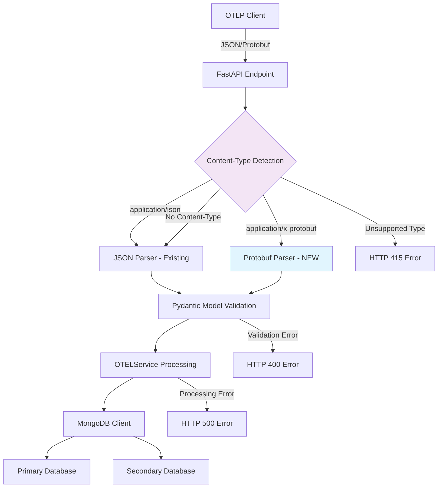

# Design Document: Protocol Buffer Support for OpenTelemetry API

## Overview

This design extends the existing JSON-only OpenTelemetry to MongoDB API to support Protocol Buffer (protobuf) binary format, enabling dual content-type support (`application/json` and `application/x-protobuf`) for all telemetry endpoints. The design leverages existing FastAPI infrastructure, Pydantic models, and processing pipelines while adding a thin protobuf parsing layer that converts binary OTLP messages to the same internal data structures.

## Code Reuse Analysis

### Existing Components to Leverage
- **FastAPI Architecture** (app/main.py): All endpoint definitions, global exception handler, dependency injection patterns
- **Pydantic Models** (app/models.py): Complete OTEL data model hierarchy with validation and serialization
- **OTELService** (app/otel_service.py): All processing methods (`process_traces`, `process_metrics`, `process_logs`) and counting logic
- **MongoDB Client** (app/mongo_client.py): Dual database write operations with primary/secondary failover
- **Testing Infrastructure** (app/tests/): Unit test patterns with mongomock, integration tests with Docker, existing fixtures
- **Structured Logging** (structlog): JSON output format with correlation IDs and error tracking
- **Development Tooling** (pyproject.toml): Ruff configuration, mypy type checking, pytest markers

### Integration Strategy
- **Minimal Changes to Core Logic**: Protobuf support adds only parsing layer, no changes to business logic
- **Same Endpoint URLs**: `/v1/traces`, `/v1/metrics`, `/v1/logs` handle both content types
- **Unified Data Flow**: Both JSON and protobuf convert to same Pydantic models before processing
- **Backward Compatibility**: JSON processing remains unchanged, protobuf is additive only

## Architecture



### Request Flow
1. **Request Reception**: FastAPI receives request with Content-Type header
2. **Content-Type Detection**: Route to appropriate parser based on header
3. **Data Parsing**: Convert JSON or protobuf to Python objects
4. **Model Validation**: Apply existing Pydantic validation rules
5. **Service Processing**: Use existing OTELService methods unchanged
6. **Database Storage**: Use existing MongoDB client with failover
7. **Response Generation**: Return OTLP-compliant responses

## Components and Interfaces

### New Component: ProtobufParser

**Location**: `app/protobuf_parser.py`

```python
from opentelemetry.proto.collector.trace.v1.trace_service_pb2 import ExportTraceServiceRequest
from opentelemetry.proto.collector.metrics.v1.metrics_service_pb2 import ExportMetricsServiceRequest
from opentelemetry.proto.collector.logs.v1.logs_service_pb2 import ExportLogsServiceRequest

class ProtobufParser:
    """Parser for OTLP protobuf messages to Pydantic models."""

    def parse_traces(self, data: bytes) -> OTELTracesData:
        """Parse protobuf traces to OTELTracesData model."""

    def parse_metrics(self, data: bytes) -> OTELMetricsData:
        """Parse protobuf metrics to OTELMetricsData model."""

    def parse_logs(self, data: bytes) -> OTELLogsData:
        """Parse protobuf logs to OTELLogsData model."""
```

**Reuse Strategy**:
- _Leverage_: Existing Pydantic models for validation and structure
- _Extend_: Add conversion logic from protobuf objects to dict format expected by Pydantic
- _Integrate_: Use same error handling patterns as JSON validation

### Enhanced Component: FastAPI Endpoints

**Location**: `app/main.py` (modify existing endpoints)

```python
# Modified endpoint signature supporting both content types
@app.post("/v1/traces", response_model=ExportTraceServiceResponse)
async def submit_traces(
    request: Request,
    mongodb_client: MongoDBClient = Depends(get_mongodb_client)
):
    """Submit OpenTelemetry traces (JSON or protobuf format)."""
    content_type = request.headers.get("content-type", "application/json").lower()

    if content_type == "application/json":
        # Existing JSON path - unchanged
        pass
    elif content_type == "application/x-protobuf":
        # New protobuf path
        pass
    else:
        # HTTP 415 Unsupported Media Type
        pass
```

**Reuse Strategy**:
- _Leverage_: Existing FastAPI dependency injection, error handling, response models
- _Extend_: Add content-type detection logic before existing processing
- _Maintain_: Keep same URLs, same response formats, same error handling patterns

### New Component: ContentTypeHandler

**Location**: `app/content_handler.py`

```python
class ContentTypeHandler:
    """Handles content-type detection and routing."""

    def __init__(self):
        self.protobuf_parser = ProtobufParser()

    async def parse_request_data(
        self,
        request: Request,
        data_type: str
    ) -> OTELTracesData | OTELMetricsData | OTELLogsData:
        """Parse request data based on content type."""
```

**Reuse Strategy**:
- _Leverage_: FastAPI Request object handling patterns
- _Integrate_: Use existing logger for content-type detection events
- _Extend_: Add new parsing logic while maintaining existing JSON path

## Data Models

### Existing Pydantic Models (No Changes)
All existing models in `app/models.py` remain unchanged:
- `OTELTracesData`, `OTELMetricsData`, `OTELLogsData`
- `OTELSpan`, `OTELMetric`, `OTELLogRecord`
- Response models: `ExportTraceServiceResponse`, etc.
- Error models: `ErrorResponse`, `Status`

### Protobuf to Pydantic Conversion Strategy

```python
# Example conversion logic
def protobuf_to_pydantic_traces(pb_request: ExportTraceServiceRequest) -> dict:
    """Convert protobuf traces to dict suitable for Pydantic."""
    return {
        "resourceSpans": [
            {
                "resource": convert_resource(rs.resource),
                "scopeSpans": [
                    {
                        "scope": convert_scope(ss.scope),
                        "spans": [convert_span(span) for span in ss.spans]
                    }
                    for ss in rs.scope_spans
                ]
            }
            for rs in pb_request.resource_spans
        ]
    }
```

**Reuse Strategy**:
- _Leverage_: Exact same dict structure expected by existing Pydantic models
- _Maintain_: Same field names, validation rules, alias mappings
- _Preserve_: All existing model behaviors, validators, serialization methods

## Error Handling

### Content-Type Errors
- **HTTP 415**: Unsupported Media Type for unknown content types
- **HTTP 400**: Bad Request for malformed protobuf data
- **Fallback**: Default to JSON parsing when no Content-Type header present

### Protobuf Parsing Errors
```python
try:
    pb_request = ExportTraceServiceRequest()
    pb_request.ParseFromString(raw_data)
except Exception as e:
    logger.error("Protobuf parsing failed", error=str(e))
    raise HTTPException(status_code=400, detail=f"Invalid protobuf data: {str(e)}")
```

**Reuse Strategy**:
- _Leverage_: Existing global exception handler in main.py (lines 80-88)
- _Extend_: Use same structured logging patterns for protobuf errors
- _Maintain_: Same error response formats, same HTTP status codes for equivalent errors

### Validation Errors
Protobuf-parsed data follows same Pydantic validation path:
- Same field validation rules
- Same error message formats
- Same HTTP 422 responses for validation failures

## Testing Strategy

### Unit Tests (app/tests/test_protobuf_parser.py)
**Reuse Strategy**:
- _Leverage_: Existing pytest configuration, mongomock patterns
- _Extend_: Add protobuf-specific test fixtures and data samples
- _Follow_: Same test organization patterns as test_otel_service.py

```python
@pytest.mark.unit
class TestProtobufParser:
    def test_parse_traces_valid_data(self, sample_protobuf_traces):
        """Test parsing valid protobuf traces data."""

    def test_parse_traces_invalid_data(self):
        """Test parsing invalid protobuf data raises error."""

    def test_parse_metrics_conversion(self, sample_protobuf_metrics):
        """Test protobuf to Pydantic model conversion."""
```

### Integration Tests (app/tests/integration/test_protobuf_integration.py)
**Reuse Strategy**:
- _Leverage_: Existing Docker MongoDB container setup
- _Extend_: Add protobuf request scenarios to existing endpoint tests
- _Follow_: Same async test patterns as test_integration.py

```python
@pytest.mark.integration
class TestProtobufIntegration:
    async def test_protobuf_traces_end_to_end(self, client, mongodb_container):
        """Test complete protobuf traces workflow."""

    async def test_mixed_content_types(self, client, mongodb_container):
        """Test JSON and protobuf requests to same endpoints."""
```

### Test Fixtures and Data
**New Test Data**: `app/tests/fixtures/protobuf_data.py`
**Reuse Strategy**:
- _Leverage_: Existing fixture organization patterns from fixtures/otel_data.py
- _Convert_: Existing JSON test data to equivalent protobuf messages
- _Maintain_: Same data scenarios, same edge cases covered

### Modified Existing Tests
**Enhanced Tests**: `app/tests/test_main.py`
- Update content-type tests to handle both JSON and protobuf
- Add HTTP 415 test cases for unsupported content types
- Verify backward compatibility for JSON-only requests

## Performance Considerations

### Memory Usage
- **Protobuf Advantage**: Binary format typically 20-50% smaller than JSON
- **Parsing Overhead**: Protobuf parsing generally faster than JSON for large payloads
- **Memory Footprint**: Similar final memory usage after conversion to Pydantic models

### Request Processing
- **Content-Type Detection**: Minimal overhead (single header lookup)
- **Parsing Path**: Separate code paths but same validation and processing pipeline
- **Response Generation**: No changes to existing response serialization

### Database Storage
- **No Changes**: Same MongoDB document format regardless of input content type
- **Same Performance**: Identical database write patterns and failover behavior

## Dependencies

### New Dependencies (add to pyproject.toml)
```toml
dependencies = [
    # ... existing dependencies ...
    "opentelemetry-proto>=1.25.0",  # OTLP protobuf message definitions
]
```

### Justification
- **opentelemetry-proto**: Official OpenTelemetry protobuf bindings, mature and stable
- **No Additional Libraries**: Uses existing protobuf support from opentelemetry-proto
- **Minimal Impact**: Single new dependency, well-maintained, compatible with existing stack

## Migration and Rollout Strategy

### Phase 1: Implementation
- Add protobuf parsing components
- Modify endpoint handlers for content-type detection
- Implement comprehensive test suite

### Phase 2: Testing
- Unit tests with protobuf message fixtures
- Integration tests with real protobuf clients
- Performance benchmarking vs JSON processing

### Phase 3: Deployment
- Feature flag for protobuf support (environment variable)
- Gradual rollout with monitoring
- Documentation updates for API clients

### Backward Compatibility Guarantee
- All existing JSON clients continue working unchanged
- Default behavior remains JSON parsing
- No breaking changes to API contracts or response formats
